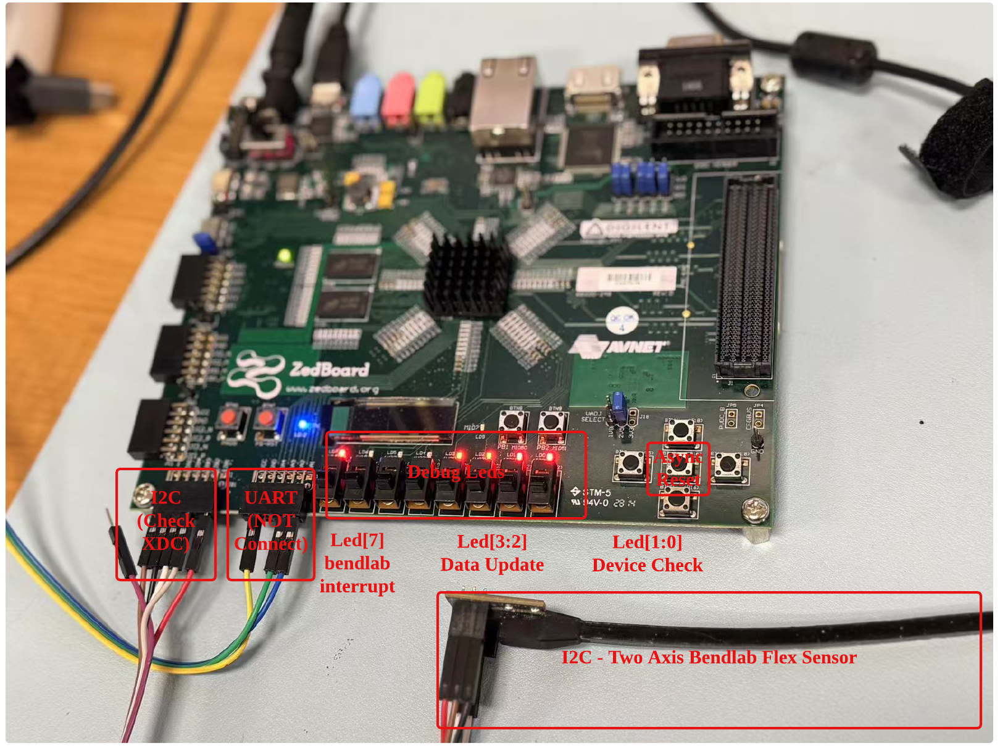
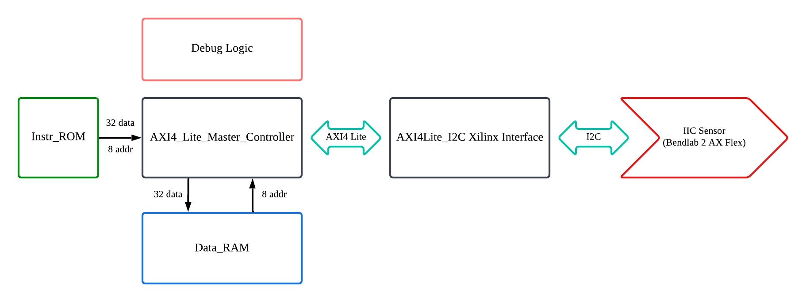

# HDL AXI I2C Device Controller Design on ZedBoard

This repository contains a Vivado project that implements an AXI4-Lite-based I2C Device Controller and ISA Design. 

## Requirements

- **Vivado Version**: 2023.1 or higher  
- **Board**: ZedBoard (Zynq-7000)
- **Sensor**: Bendlab Motion & Position 2-Axis Bidirectional Flex Sensor 
- 
## Getting Started

### 1. Clone the Repository

```bash
git clone https://github.com/xiaoz119/bendlab_hdl_ctrl_zed.git
cd bendlab_hdl_ctrl_zed
```

### 2. Launch Vivado and Open the TCL Console
Start Vivado and open the Tcl Console.

### 3. Run the Setup Script
In the Tcl Console, navigate to the project directory and run:

```bash
cd <full_path_to_repo>
source project_1.tcl
```

This will automatically create the Vivado project, add all necessary source files, and configure the design.
## Notes
- Ensure the Vivado version is 2023.1 or newer to avoid compatibility issues.
- IP cores may require regeneration if opened in a different environment.

## Board Setup
<p align="center">
  
</p


----------------------  
## Block Diagram
<p align="center">
  
</p


---------------------- 


## Controller Instruction Set Architecture
### ⚙️ Instruction Running Logic
- The instruction is stored in the local memory with depth of 512 and width of 32 bits.
- There are two part of instruction, **configuration part** and **execution part**.
  - The **configuration** part is to configure the Iterupt and device which only run once.
  - The **execution** part is to running iteratively if no stall or delay.
- Detali isntruction generation please refer to the bin_generator.py file inside InstrGen.
  
### ⚙️ `OPCODE` (Bits 2:0)

| Value | Operation                        |
|-------|----------------------------------|
| `000` | No Operation (NOP)               |
| `001` | AXI4 Read to Local Memory        |
| `010` | AXI4 Write from Local Memory     |
| `011` | AXI4 Write from Instruction Data |
| `100` | Time Delay                       |
| `101` | AXI Read Compare, and Check/Pass |
| `110` | Interrupt Neg Edge Check/Pass    |
| `111` | Stall                            |


### 🧠 Instruction Format R-type (AXI Read and Write)

- **R-type AXI read** is to read the data from the AXI4-Lite interface (`ADDR_AXI`) and write it to the local memory (`ADDR_LOCAL`). 
- **R-type AXI write** is to read the data from the local memory (`ADDR_LOCAL`) and write it to the AXI4-Lite interface (`ADDR_AXI`).

| Bit Range  | 31–27       | 26–20     | 19–12       | 11–3        | 2–0      |
|------------|-------------|-----------|-------------|-------------|----------|
| Field Name | `RESERVED`  | `COUNT`   | `ADDR_LOCAL`| `ADDR_AXI`  | `OPCODE` |
        
Each instruction is exactly 32 bits, structured as follows:

| Bits       | Field Name   | Width | Description                                 |
|------------|--------------|-------|---------------------------------------------|
| 31 – 27    | `RESERVED`   | 5     | Reserved for future use                     |
| 26 – 20    | `COUNT`      | 7     | Number of read/write transactions (0–127)   |
| 19 – 12    | `ADDR_LOCAL` | 8     | local address                               |
| 11 – 3     | `ADDR_AXI`   | 9     | AXI4-Lite address (9-bit aligned)           |
| 2 – 0      | `OPCODE`     | 3     | Operation type (AXI Read, Write from load)  |

### 🧠 Instruction Format (I Type AXI Write)

- **I-type AXI write** is to write the data from the instruction field (`WRITE_DATA`) to the AXI4-Lite interface (`ADDR_AXI`).

| Bit Range  | 31–12       | 11–3        | 2–0      |
|------------|-------------|-------------|----------|
| Field Name | `WRITE_DATA`| `ADDR_AXI`  | `OPCODE` |


| Bits       | Field Name   | Width | Description                                 |
|------------|--------------|-------|---------------------------------------------|
| 31 – 12    | `WRITE_DATA` | 20    | Data to be written to the AXI4-Lite address |
| 11 – 3     | `ADDR_AXI`   | 9     | AXI4-Lite address (9-bit aligned)           |
| 2 – 0      | `OPCODE`     | 3     | Operation type (e.g., AXI Write)            |

### 🧠  Instruction Format  (AXI Read Compare and Pass if ture)
- **I-type AXI read compare** is to read the data from the AXI4-Lite interface (`ADDR_AXI`) and compare it with the instruction field (`COMPARE_VALUE`). If the comparison is true, the instruction passes otherwise start a new AXI read from the same address.

| Bit Range  | 31–14          | 13-12       | 11–3        | 2–0      |
|------------|-----------     |-------------|-------------|----------|
| Field Name | `COMPARE_VALUE`| `CHECK_OP`  | `ADDR_AXI`  | `OPCODE` |

Each instruction is exactly 32 bits, structured as follows:

| Bits       | Field Name     | Width | Description                                 |
|------------|----------------|-------|---------------------------------------------|
| 31 – 14    | `COMPARE_VALUE`| 18    | Value to compare against AXI read data      |
| 13 – 12    | `CHECK_OP`     | 2     | Specifies the comparison operation to perform. |
| 11 – 3     | `ADDR_AXI`     | 9     | AXI4-Lite address (9-bit aligned)           |
| 2 – 0      | `OPCODE`       | 3     | Operation type (e.g., Read Compare)         |

#### `CHECK_OP` (Bits 13:12)

| Value | Operation       |
|-------|-----------------|
| `00`  | AND True Pass   |
| `01`  | AND False Pass  |               |
| `10`  |  Reserve        |
| `11`  |  Reserve        |

### 🧠 Delay Counter

- **Delay counter** is to delay the execution of the next instruction for a specified number of clock cycles (100MHz). 


| Bit Range  | 31–3         | 2–0      |
|------------|------------- |----------|
| Field Name | `DELAY_COUNT`| `OPCODE` | 

Each instruction is exactly 32 bits, structured as follows:

| Bits       | Field Name   | Width | Description                                 |
|------------|--------------|-------|---------------------------------------------|
| 31 – 3     | `DELAY_COUNT`| 29    | Number of clock cycles to delay             |
| 2 – 0      | `OPCODE`     | 3     | Operation type (e.g., Time Delay)           |


### 🧠 Interupt Negative Edge Signal Check/Pass

- **Interupt negative edge check** is to check the negative edge of the interupt signal. If the interupt signal is low, the instruction passes otherwise keep checking the interupt signal until it goes low.

Each instruction is exactly 32 bits, structured as follows:

| Bit Range  | 31–3         | 2–0      |
|------------|------------- |----------|
| Field Name | `Reserved`   | `OPCODE` | 